# autiCare

## Description
autiCare is designed to be a support for parents and caregivers of children with autism and to help children to express needs and emotion.

The application allows users to create a profile, define patient's profile, create tasks, and track progress of the tasks.
Also, caregiver can see log of children's emotions and needs.
autiCare is designed to be a support for parents and caregivers of children with autism and to help children to express needs and emotion.

## Table of Contents
* [Installation](#installation)
* [Usage](#usage)

## Installation
To install autiCare, download apk file from the repository and install it on your Android device.
Web application is available at https://antiv.github.io/autism-dev/web/

## Usage
To use autiCare, login with google account. App will crete a caregiver profile for you. 
You can add your child's profile from profile page -> client list. 
You can also edit your profile from profile page -> edit profile.

As caregiver, on reactions page, you can see the log of your child's emotions and needs and export it to xls file.
On calendar page you can add tasks for your child and track progress of the tasks.

As child, you can see your tasks on calendar page and mark them as done.
On emotions page, children can select emotion from animated emotions-well.
On needs page, children can select need from animated needs-well.

## Screenshots

### Caregiver
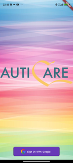
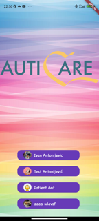
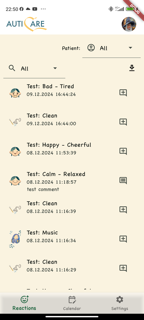
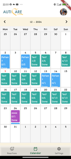
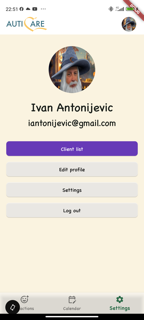
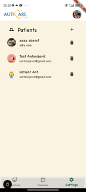
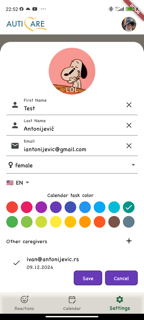
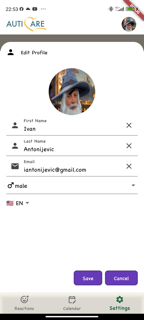
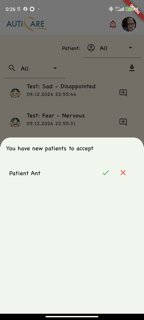

### Child
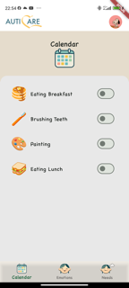
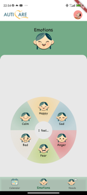
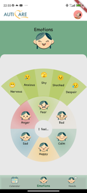
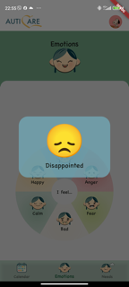
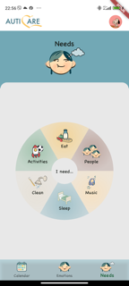

    
